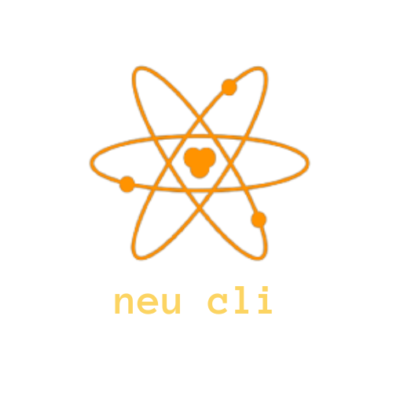

<div align="center"></div>

[](https://github.com/neutralinojs/neutralinojs-cli/releases)


[](https://github.com/neutralinojs/neutralinojs-cli/commits/main)


The official CLI of Neutralinojs. See neu CLI [documentation](https://neutralino.js.org/docs/cli/neu-cli/) for more details. Release notes are available at [this page](https://neutralino.js.org/docs/release-notes/cli).

```bash
npm i -g @neutralinojs/neu
```
### Requirements

- Node.js v12 or later version.
- npm, yarn, or any Node.js package manager.

### License

[MIT](LICENSE)

### Contributing to Neutralinojs

We really appreciate your code contributions. Please read [this contribution guide](https://neutralino.js.org/docs/contributing/framework-developer-guide#contribution-guidelines) before sending a pull request. Thank you for your contributions.

#### ⚠️ Notice for contributors
Please note that we would like to keep this project's dependencies list minimal as possible. Make sure that you don't add new dependencies (external `npm` modules) with your pull requests. Also, don't use latest Node/JavaScript features that won't work on older Node.js versions. Thank you :tada:

### Contributors

<a href="https://github.com/neutralinojs/neutralinojs-cli/graphs/contributors">
  
</a>

Made with [contributors-img](https://contrib.rocks).
