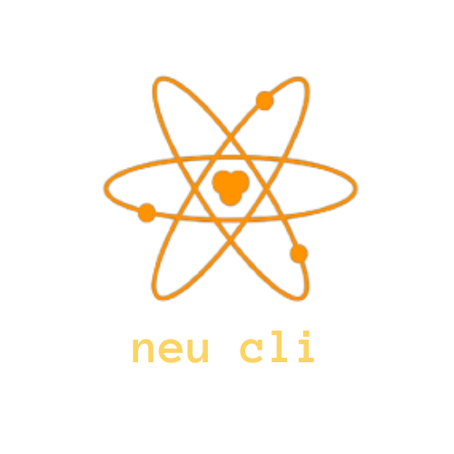

<div align="center">
  
</div>

<br/>

<p align="center">
  <b>The official CLI for building lightweight desktop apps with Neutralinojs</b>
</p>

<p align="center">
  <a href="https://github.com/neutralinojs/neutralinojs-cli/releases">
    
  </a>
  
  
  <a href="https://github.com/neutralinojs/neutralinojs-cli/commits/main">
    
  </a>
  
</p>

---

## 📦 About

`neu` is the official CLI tool for Neutralinojs — a lightweight and portable framework for building cross-platform desktop applications using web technologies like HTML, CSS, and JavaScript.

It helps developers quickly scaffold, run, and build Neutralinojs applications with minimal setup and dependencies.

---

## ✨ Features

* ⚡ Instantly create new Neutralinojs applications
* 🏃 Run apps locally with live reload
* 📦 Build production-ready applications
* 🔧 Minimal dependencies and fast execution
* 🌍 Cross-platform support (Windows, Linux, macOS)

---

## 🚀 Installation

Install globally using npm:

```bash
npm install -g @neutralinojs/neu
```

---

## ⚡ Quick Start

### 1. Create a new app

```bash
neu create myApp
cd myApp
```

### 2. Run the app

```bash
neu run
```

### 3. Build the app

```bash
neu build
```

---

## 🛠️ CLI Commands

| Command      | Description                   |
| ------------ | ----------------------------- |
| `neu create` | Create a new Neutralinojs app |
| `neu run`    | Run the application locally   |
| `neu build`  | Build the application         |
| `neu help`   | Show available commands       |

---

## 📂 Project Structure

```
myApp/
├── resources/
├── neutralino.config.json
├── index.html
└── ...
```

---

## ⚙️ Requirements

* Node.js >= 12.x
* npm / yarn / pnpm
* Supported OS: Windows, Linux, macOS

---

## 📚 Documentation

* 📖 CLI Docs: https://neutralino.js.org/docs/cli/neu-cli/
* 📝 Release Notes: https://neutralino.js.org/docs/release-notes/cli
* 🤝 Contribution Guide: https://neutralino.js.org/docs/contributing/framework-developer-guide

---

## 🧩 Troubleshooting

### ❌ `neu` command not found

Make sure global npm packages are added to your system `PATH`.

---

### 🔐 Permission issues (Linux/macOS)

Try installing with elevated permissions:

```bash
sudo npm install -g @neutralinojs/neu
```

---

## 🤝 Contributing

We really appreciate your contributions ❤️

Before submitting a pull request, please read the official contribution guide:
https://neutralino.js.org/docs/contributing/framework-developer-guide#contribution-guidelines

### ⚠️ Notice for contributors

* Keep dependencies minimal (avoid adding external npm modules)
* Ensure compatibility with older Node.js versions
* Follow existing code style and project philosophy

---

## 👥 Contributors

<a href="https://github.com/neutralinojs/neutralinojs-cli/graphs/contributors">
  
</a>

---

## 📄 License

This project is licensed under the MIT License.
